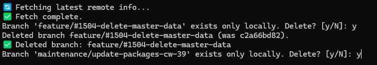

# Git Buddy

Here's a small helper script to interactively clean up local branches without a connection to the origin - aka merged branches.
 
I've you're interested, just clone https://github.com/GitRon/git-buddy and start the command like:

> /path/to/git-buddy/branch_vacuum.py /path/to/my/repo

## Example shell output

